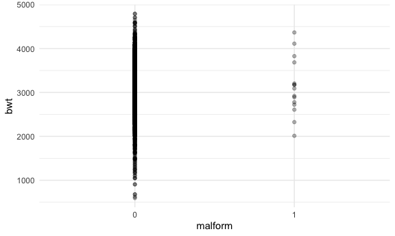

Homework 6
================

``` r
library(tidyverse)
```

    ## ── Attaching packages ─────────────────────────────────────── tidyverse 1.3.1 ──

    ## ✓ ggplot2 3.3.5     ✓ purrr   0.3.4
    ## ✓ tibble  3.1.5     ✓ dplyr   1.0.7
    ## ✓ tidyr   1.1.3     ✓ stringr 1.4.0
    ## ✓ readr   2.0.1     ✓ forcats 0.5.1

    ## ── Conflicts ────────────────────────────────────────── tidyverse_conflicts() ──
    ## x dplyr::filter() masks stats::filter()
    ## x dplyr::lag()    masks stats::lag()

``` r
library(viridis)
```

    ## Loading required package: viridisLite

``` r
library(modelr)
library(mgcv)
```

    ## Loading required package: nlme

    ## 
    ## Attaching package: 'nlme'

    ## The following object is masked from 'package:dplyr':
    ## 
    ##     collapse

    ## This is mgcv 1.8-38. For overview type 'help("mgcv-package")'.

``` r
library(patchwork)

knitr::opts_chunk$set(
  fig.width = 6,
  fig.asp = .6,
  out.width = "90%"
)

theme_set(theme_minimal() + theme(legend.position = "bottom"))

options(
  ggplot2.continuous.colour = "viridis",
  ggplot2.continuous.fill = "viridis"
)

scale_colour_discrete = scale_colour_viridis_d
scale_fill_discrete = scale_fill_viridis_d
```

## Problem 1

``` r
birthweight_df = 
  read_csv("data/birthweight.csv") %>% 
  mutate(babysex = as.factor(babysex), 
         fincome = fincome*100, 
         frace = as.factor(frace), 
         malform = as.factor(malform), 
         mrace = as.factor(mrace)) 
```

    ## Rows: 4342 Columns: 20

    ## ── Column specification ────────────────────────────────────────────────────────
    ## Delimiter: ","
    ## dbl (20): babysex, bhead, blength, bwt, delwt, fincome, frace, gaweeks, malf...

    ## 
    ## ℹ Use `spec()` to retrieve the full column specification for this data.
    ## ℹ Specify the column types or set `show_col_types = FALSE` to quiet this message.

Checking for missing values by grouping by factor variables to identify
possible values:

``` r
birthweight_df %>% 
  group_by(babysex) %>% 
  summarize()
```

    ## # A tibble: 2 × 1
    ##   babysex
    ##   <fct>  
    ## 1 1      
    ## 2 2

``` r
birthweight_df %>% 
  group_by(frace) %>% 
  summarize()
```

    ## # A tibble: 5 × 1
    ##   frace
    ##   <fct>
    ## 1 1    
    ## 2 2    
    ## 3 3    
    ## 4 4    
    ## 5 8

``` r
birthweight_df %>% 
  group_by(malform) %>% 
  summarize()
```

    ## # A tibble: 2 × 1
    ##   malform
    ##   <fct>  
    ## 1 0      
    ## 2 1

``` r
birthweight_df %>% 
  group_by(mrace) %>% 
  summarize()
```

    ## # A tibble: 4 × 1
    ##   mrace
    ##   <fct>
    ## 1 1    
    ## 2 2    
    ## 3 3    
    ## 4 4

``` r
birthweight_df
```

    ## # A tibble: 4,342 × 20
    ##    babysex bhead blength   bwt delwt fincome frace gaweeks malform menarche
    ##    <fct>   <dbl>   <dbl> <dbl> <dbl>   <dbl> <fct>   <dbl> <fct>      <dbl>
    ##  1 2          34      51  3629   177    3500 1        39.9 0             13
    ##  2 1          34      48  3062   156    6500 2        25.9 0             14
    ##  3 2          36      50  3345   148    8500 1        39.9 0             12
    ##  4 1          34      52  3062   157    5500 1        40   0             14
    ##  5 2          34      52  3374   156     500 1        41.6 0             13
    ##  6 1          33      52  3374   129    5500 1        40.7 0             12
    ##  7 2          33      46  2523   126    9600 2        40.3 0             14
    ##  8 2          33      49  2778   140     500 1        37.4 0             12
    ##  9 1          36      52  3515   146    8500 1        40.3 0             11
    ## 10 1          33      50  3459   169    7500 2        40.7 0             12
    ## # … with 4,332 more rows, and 10 more variables: mheight <dbl>, momage <dbl>,
    ## #   mrace <fct>, parity <dbl>, pnumlbw <dbl>, pnumsga <dbl>, ppbmi <dbl>,
    ## #   ppwt <dbl>, smoken <dbl>, wtgain <dbl>

``` r
birthweight_df %>% 
  drop_na()
```

    ## # A tibble: 4,342 × 20
    ##    babysex bhead blength   bwt delwt fincome frace gaweeks malform menarche
    ##    <fct>   <dbl>   <dbl> <dbl> <dbl>   <dbl> <fct>   <dbl> <fct>      <dbl>
    ##  1 2          34      51  3629   177    3500 1        39.9 0             13
    ##  2 1          34      48  3062   156    6500 2        25.9 0             14
    ##  3 2          36      50  3345   148    8500 1        39.9 0             12
    ##  4 1          34      52  3062   157    5500 1        40   0             14
    ##  5 2          34      52  3374   156     500 1        41.6 0             13
    ##  6 1          33      52  3374   129    5500 1        40.7 0             12
    ##  7 2          33      46  2523   126    9600 2        40.3 0             14
    ##  8 2          33      49  2778   140     500 1        37.4 0             12
    ##  9 1          36      52  3515   146    8500 1        40.3 0             11
    ## 10 1          33      50  3459   169    7500 2        40.7 0             12
    ## # … with 4,332 more rows, and 10 more variables: mheight <dbl>, momage <dbl>,
    ## #   mrace <fct>, parity <dbl>, pnumlbw <dbl>, pnumsga <dbl>, ppbmi <dbl>,
    ## #   ppwt <dbl>, smoken <dbl>, wtgain <dbl>

There are no missing values based on the drop NA function

\*\* OTHER NA OPTIONS?

Fitting models

``` r
birthweight_df %>% 
  ggplot(aes(x = blength, y = bwt)) +
  geom_point()
```


``` r
birthweight_df %>% 
  ggplot(aes(x = malform, y = bwt)) +
  geom_point(alpha = 0.3)
```



``` r
birthweight_df %>% 
  ggplot(aes(x = momage, y = bwt)) +
  geom_point(alpha = 0.3)
```


``` r
fit_mine = lm(bwt ~ blength + gaweeks + malform + momage, data = birthweight_df)

fit_length = lm(bwt ~ blength + gaweeks, data = birthweight_df)
fit_interaction = lm(bwt ~ bhead*blength*babysex, data = birthweight_df)
```
