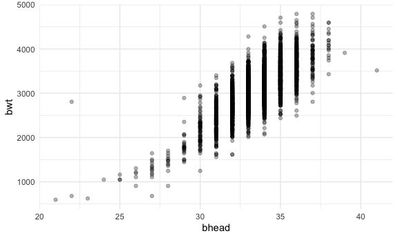
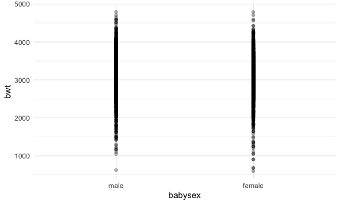
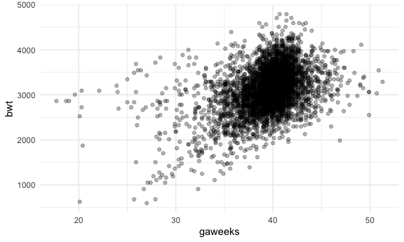

Homework 6
================

``` r
library(tidyverse)
library(viridis)

library(modelr)
library(mgcv)

knitr::opts_chunk$set(
  fig.width = 6,
  fig.asp = .6,
  out.width = "90%"
)

theme_set(theme_minimal() + theme(legend.position = "bottom"))

options(
  ggplot2.continuous.colour = "viridis",
  ggplot2.continuous.fill = "viridis"
)

scale_colour_discrete = scale_colour_viridis_d
scale_fill_discrete = scale_fill_viridis_d
```

## Problem 1

``` r
birthweight_df = 
  read_csv("data/birthweight.csv") %>% 
  mutate(babysex = as.factor(babysex), 
         babysex = fct_recode(babysex, "male" = "1", "female" = "2"),
         fincome = fincome*100, 
         frace = as.factor(frace), 
         frace = fct_recode(frace, "white" = "1", "black" = "2", "asian" = "3",
                       "puerto rican" = "4", "other" = "8"),
         malform = as.logical(malform), 
         mrace = as.factor(mrace), 
         mrace = fct_recode(mrace, "white" = "1", "black" = "2", "asian" = "3",
                       "puerto rican" = "4"))
```

``` r
summary(birthweight_df)
```

    ##    babysex         bhead          blength           bwt           delwt      
    ##  male  :2230   Min.   :21.00   Min.   :20.00   Min.   : 595   Min.   : 86.0  
    ##  female:2112   1st Qu.:33.00   1st Qu.:48.00   1st Qu.:2807   1st Qu.:131.0  
    ##                Median :34.00   Median :50.00   Median :3132   Median :143.0  
    ##                Mean   :33.65   Mean   :49.75   Mean   :3114   Mean   :145.6  
    ##                3rd Qu.:35.00   3rd Qu.:51.00   3rd Qu.:3459   3rd Qu.:157.0  
    ##                Max.   :41.00   Max.   :63.00   Max.   :4791   Max.   :334.0  
    ##     fincome              frace         gaweeks       malform       
    ##  Min.   :   0   white       :2123   Min.   :17.70   Mode :logical  
    ##  1st Qu.:2500   black       :1911   1st Qu.:38.30   FALSE:4327     
    ##  Median :3500   asian       :  46   Median :39.90   TRUE :15       
    ##  Mean   :4411   puerto rican: 248   Mean   :39.43                  
    ##  3rd Qu.:6500   other       :  14   3rd Qu.:41.10                  
    ##  Max.   :9600                       Max.   :51.30                  
    ##     menarche        mheight          momage              mrace     
    ##  Min.   : 0.00   Min.   :48.00   Min.   :12.0   white       :2147  
    ##  1st Qu.:12.00   1st Qu.:62.00   1st Qu.:18.0   black       :1909  
    ##  Median :12.00   Median :63.00   Median :20.0   asian       :  43  
    ##  Mean   :12.51   Mean   :63.49   Mean   :20.3   puerto rican: 243  
    ##  3rd Qu.:13.00   3rd Qu.:65.00   3rd Qu.:22.0                      
    ##  Max.   :19.00   Max.   :77.00   Max.   :44.0                      
    ##      parity            pnumlbw     pnumsga      ppbmi            ppwt      
    ##  Min.   :0.000000   Min.   :0   Min.   :0   Min.   :13.07   Min.   : 70.0  
    ##  1st Qu.:0.000000   1st Qu.:0   1st Qu.:0   1st Qu.:19.53   1st Qu.:110.0  
    ##  Median :0.000000   Median :0   Median :0   Median :21.03   Median :120.0  
    ##  Mean   :0.002303   Mean   :0   Mean   :0   Mean   :21.57   Mean   :123.5  
    ##  3rd Qu.:0.000000   3rd Qu.:0   3rd Qu.:0   3rd Qu.:22.91   3rd Qu.:134.0  
    ##  Max.   :6.000000   Max.   :0   Max.   :0   Max.   :46.10   Max.   :287.0  
    ##      smoken           wtgain      
    ##  Min.   : 0.000   Min.   :-46.00  
    ##  1st Qu.: 0.000   1st Qu.: 15.00  
    ##  Median : 0.000   Median : 22.00  
    ##  Mean   : 4.145   Mean   : 22.08  
    ##  3rd Qu.: 5.000   3rd Qu.: 28.00  
    ##  Max.   :60.000   Max.   : 89.00

There are no missing values based on the summary function.

Fitting model:

I hypothesize that a few things are key drivers of a baby’s birthweight.
First, baby length is likely to affect birthweight significantly.
Additionally, baby’s head circumference could have a similar effect. I
imagine that male and female babies are relatively similar in weight, so
I doubt that baby’s sex has much of an effect. Mother’s weight gain
during pregnancy could also be an indicator of baby’s weight, as well as
the number of previous low birthweight babies for women who have had
children prior.

``` r
birthweight_df %>% 
  ggplot(aes(x = blength, y = bwt)) +
  geom_point()
```


``` r
# baby length appears to increase with increasing birthweight 

birthweight_df %>% 
  ggplot(aes(x = bhead, y = bwt)) +
  geom_point(alpha = 0.3)
```



``` r
# baby head circumference also appears to increase with increasing birthweight 

birthweight_df %>% 
  ggplot(aes(x = babysex, y = bwt)) +
  geom_point(alpha = 0.3) 
```



``` r
# visual inspection appears to confirm that birthweight is not meaningfully different by sex; further inspection may help to confirm this: 

birthweight_df %>% 
  group_by(babysex) %>% 
  summarize(mean_bwt = mean(bwt))
```

    ## # A tibble: 2 × 2
    ##   babysex mean_bwt
    ##   <fct>      <dbl>
    ## 1 male       3158.
    ## 2 female     3069.

``` r
# weights differ by less than 3% so this is not likely an informative predictor

birthweight_df %>% 
  ggplot(aes(x = wtgain, y = bwt)) +
  geom_point(alpha = 0.3)
```


``` r
# this also doesn't appear to demonstrate a meaningful trend, but will be included to test. 

birthweight_df %>% 
  ggplot(aes(x = gaweeks, y = bwt)) +
  geom_point(alpha = 0.3)
```



``` r
#There does appear to be a trend here; potentially, the interaction between gestational weeks and baby's head size could be interesting, as a baby's head development is a critical component of fetal development. 

birthweight_df %>% 
  ggplot(aes(x = pnumlbw, y = bwt)) +
  geom_point(alpha = 0.3)
```


``` r
# There appear to be no values other than 0 for this variable 

birthweight_df %>% 
  group_by(pnumlbw) %>% 
  summarize(obs = n())
```

    ## # A tibble: 1 × 2
    ##   pnumlbw   obs
    ##     <dbl> <int>
    ## 1       0  4342

``` r
# finding confirmed - variable will not be meaningful, but I will test to confirm. 

fit_tries = lm(bwt ~ blength + pnumlbw + gaweeks*bhead + babysex, data = birthweight_df)

fit_tries %>% 
  broom::tidy()
```

    ## # A tibble: 7 × 5
    ##   term          estimate std.error statistic    p.value
    ##   <chr>            <dbl>     <dbl>     <dbl>      <dbl>
    ## 1 (Intercept)   -4591.     699.        -6.57  5.76e- 11
    ## 2 blength          82.5      2.10      39.3   7.68e-289
    ## 3 pnumlbw          NA       NA         NA    NA        
    ## 4 gaweeks         -30.9     18.6       -1.66  9.79e-  2
    ## 5 bhead            89.1     21.7        4.11  4.03e-  5
    ## 6 babysexfemale    34.8      8.85       3.93  8.49e-  5
    ## 7 gaweeks:bhead     1.36     0.561      2.42  1.57e-  2

pnumlbw should be deleted, based on this output. Additionally, although
gaweeks is not significant, the interaction between gaweeks and bhead
is, so the main effects should also be kept. babysex is surprisingly
significant, so that will also remain in the model.

``` r
fit_mine = lm(bwt ~ blength + babysex + gaweeks*bhead, data = birthweight_df)

fit_mine %>% 
  broom::tidy()
```

    ## # A tibble: 6 × 5
    ##   term          estimate std.error statistic   p.value
    ##   <chr>            <dbl>     <dbl>     <dbl>     <dbl>
    ## 1 (Intercept)   -4591.     699.        -6.57 5.76e- 11
    ## 2 blength          82.5      2.10      39.3  7.68e-289
    ## 3 babysexfemale    34.8      8.85       3.93 8.49e-  5
    ## 4 gaweeks         -30.9     18.6       -1.66 9.79e-  2
    ## 5 bhead            89.1     21.7        4.11 4.03e-  5
    ## 6 gaweeks:bhead     1.36     0.561      2.42 1.57e-  2

``` r
modelr::add_residuals(birthweight_df, fit_mine) %>% 
  add_predictions(fit_mine) %>% 
  ggplot(aes(x = pred, y = resid)) + 
  geom_point()
```


Because the residuals are all grouped together around 0, we know this is
a reasonable model.

``` r
fit_length = lm(bwt ~ blength + gaweeks, data = birthweight_df)

summary(fit_length)
```

    ## 
    ## Call:
    ## lm(formula = bwt ~ blength + gaweeks, data = birthweight_df)
    ## 
    ## Residuals:
    ##     Min      1Q  Median      3Q     Max 
    ## -1709.6  -215.4   -11.4   208.2  4188.8 
    ## 
    ## Coefficients:
    ##              Estimate Std. Error t value Pr(>|t|)    
    ## (Intercept) -4347.667     97.958  -44.38   <2e-16 ***
    ## blength       128.556      1.990   64.60   <2e-16 ***
    ## gaweeks        27.047      1.718   15.74   <2e-16 ***
    ## ---
    ## Signif. codes:  0 '***' 0.001 '**' 0.01 '*' 0.05 '.' 0.1 ' ' 1
    ## 
    ## Residual standard error: 333.2 on 4339 degrees of freedom
    ## Multiple R-squared:  0.5769, Adjusted R-squared:  0.5767 
    ## F-statistic:  2958 on 2 and 4339 DF,  p-value: < 2.2e-16

``` r
fit_interaction = lm(bwt ~ bhead*blength*babysex, data = birthweight_df)

summary(fit_interaction)
```

    ## 
    ## Call:
    ## lm(formula = bwt ~ bhead * blength * babysex, data = birthweight_df)
    ## 
    ## Residuals:
    ##      Min       1Q   Median       3Q      Max 
    ## -1132.99  -190.42   -10.33   178.63  2617.96 
    ## 
    ## Coefficients:
    ##                               Estimate Std. Error t value Pr(>|t|)    
    ## (Intercept)                 -7176.8170  1264.8397  -5.674 1.49e-08 ***
    ## bhead                         181.7956    38.0542   4.777 1.84e-06 ***
    ## blength                       102.1269    26.2118   3.896 9.92e-05 ***
    ## babysexfemale                6374.8684  1677.7669   3.800 0.000147 ***
    ## bhead:blength                  -0.5536     0.7802  -0.710 0.478012    
    ## bhead:babysexfemale          -198.3932    51.0917  -3.883 0.000105 ***
    ## blength:babysexfemale        -123.7729    35.1185  -3.524 0.000429 ***
    ## bhead:blength:babysexfemale     3.8781     1.0566   3.670 0.000245 ***
    ## ---
    ## Signif. codes:  0 '***' 0.001 '**' 0.01 '*' 0.05 '.' 0.1 ' ' 1
    ## 
    ## Residual standard error: 287.7 on 4334 degrees of freedom
    ## Multiple R-squared:  0.6849, Adjusted R-squared:  0.6844 
    ## F-statistic:  1346 on 7 and 4334 DF,  p-value: < 2.2e-16

``` r
cv_df = 
  crossv_mc(birthweight_df, 100) %>% 
  mutate(
    train = map(train, as_tibble), 
    test = map(test, as_tibble))

cv_df = 
  cv_df %>% 
  mutate(
    fit_mine = map(.x = train, ~lm(bwt ~ blength + babysex + gaweeks*bhead, data = .x)), 
    fit_length = map(.x = train, ~lm(bwt ~ blength + gaweeks, data = .x)), 
    fit_interaction = map(.x = train, ~lm(bwt ~ bhead*blength*babysex, data = .x))
  ) %>% 
  mutate(
    rmse_mine = map2_dbl(.x = fit_mine, .y = test, ~rmse(model = .x, data = .y)), 
    rmse_length = map2_dbl(.x = fit_length, .y = test, ~rmse(model = .x, data = .y)), 
    rmse_interaction = map2_dbl(.x = fit_interaction, .y = test, ~rmse(model = .x, data = .y)))
```

``` r
cv_df %>% 
  select(.id, starts_with("rmse")) %>% 
  pivot_longer(
    rmse_mine:rmse_interaction, 
    names_to = "model", 
    values_to = "rmse", 
    names_prefix = "rmse_"
  ) %>% 
  ggplot(aes(x = model, y = rmse)) + 
  geom_boxplot()
```


My model appears more reasonable than the length model, although it is
relatively comparable to the interaction model.

## Problem 2

``` r
weather_df = 
  rnoaa::meteo_pull_monitors(
    c("USW00094728"),
    var = c("PRCP", "TMIN", "TMAX"), 
    date_min = "2017-01-01",
    date_max = "2017-12-31") %>%
  mutate(
    name = recode(id, USW00094728 = "CentralPark_NY"),
    tmin = tmin / 10,
    tmax = tmax / 10) %>%
  select(name, id, everything())
```

``` r
bootstrap_weather = 
  weather_df %>% 
    bootstrap(n = 5000, id = "strap_number")

estimates_dataset = 
bootstrap_weather %>% 
    mutate(
      models = map(.x = strap, ~lm(tmax ~ tmin, data = .x)), 
      results = map(models, broom::tidy), 
      glance = map(models, broom::glance))

log_beta_df = 
estimates_dataset %>% 
    unnest(results) %>% 
      select(strap:estimate) %>% 
  pivot_wider(names_from = "term", 
              values_from = "estimate") %>% 
  janitor::clean_names() %>% 
    mutate(log_beta = log(tmin*intercept)) 

log_beta_df %>% 
  ggplot(aes(x = log_beta)) + 
  geom_density()
```


``` r
quantile(log_beta_df$log_beta, probs = c(0.025, 0.975), na.rm = FALSE)
```

    ##     2.5%    97.5% 
    ## 1.964756 2.059121

The density plot for the log of the product of the betas is relatively
normally distributed, although the left side appears a bit wider than
the right. The mean falls at approximately 2.01.

The 95% CI for the log(beta0\*beta1) estimates is 1.965 to 2.059.

``` r
r_squared_df = 
estimates_dataset %>% 
    unnest(glance) %>% 
  janitor::clean_names() 

r_squared_df %>% 
  ggplot(aes(x = r_squared)) + 
  geom_density()
```


``` r
quantile(r_squared_df$r_squared, probs = c(0.025, 0.975), na.rm = FALSE)
```

    ##      2.5%     97.5% 
    ## 0.8933113 0.9270080

The density plot for the r-sqaured values is also relatively normally
distributed, although the peak appears a bit pointed. The mean falls at
approximately 0.911.

The 95% CI for the r squared estimates is 0.893 to 0.927
