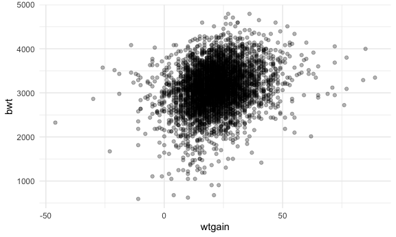

Homework 6
================

``` r
library(tidyverse)
```

    ## ── Attaching packages ─────────────────────────────────────── tidyverse 1.3.1 ──

    ## ✓ ggplot2 3.3.5     ✓ purrr   0.3.4
    ## ✓ tibble  3.1.5     ✓ dplyr   1.0.7
    ## ✓ tidyr   1.1.3     ✓ stringr 1.4.0
    ## ✓ readr   2.0.1     ✓ forcats 0.5.1

    ## ── Conflicts ────────────────────────────────────────── tidyverse_conflicts() ──
    ## x dplyr::filter() masks stats::filter()
    ## x dplyr::lag()    masks stats::lag()

``` r
library(viridis)
```

    ## Loading required package: viridisLite

``` r
library(modelr)
library(mgcv)
```

    ## Loading required package: nlme

    ## 
    ## Attaching package: 'nlme'

    ## The following object is masked from 'package:dplyr':
    ## 
    ##     collapse

    ## This is mgcv 1.8-38. For overview type 'help("mgcv-package")'.

``` r
library(patchwork)

knitr::opts_chunk$set(
  fig.width = 6,
  fig.asp = .6,
  out.width = "90%"
)

theme_set(theme_minimal() + theme(legend.position = "bottom"))

options(
  ggplot2.continuous.colour = "viridis",
  ggplot2.continuous.fill = "viridis"
)

scale_colour_discrete = scale_colour_viridis_d
scale_fill_discrete = scale_fill_viridis_d
```

## Problem 1

``` r
birthweight_df = 
  read_csv("data/birthweight.csv") %>% 
  mutate(babysex = as.factor(babysex), 
         fincome = fincome*100, 
         frace = as.factor(frace), 
         malform = as.factor(malform), 
         mrace = as.factor(mrace)) 
```

    ## Rows: 4342 Columns: 20

    ## ── Column specification ────────────────────────────────────────────────────────
    ## Delimiter: ","
    ## dbl (20): babysex, bhead, blength, bwt, delwt, fincome, frace, gaweeks, malf...

    ## 
    ## ℹ Use `spec()` to retrieve the full column specification for this data.
    ## ℹ Specify the column types or set `show_col_types = FALSE` to quiet this message.

Checking for missing values by grouping by factor variables to identify
possible values:

``` r
birthweight_df %>% 
  group_by(babysex) %>% 
  summarize()
```

    ## # A tibble: 2 × 1
    ##   babysex
    ##   <fct>  
    ## 1 1      
    ## 2 2

``` r
birthweight_df %>% 
  group_by(frace) %>% 
  summarize()
```

    ## # A tibble: 5 × 1
    ##   frace
    ##   <fct>
    ## 1 1    
    ## 2 2    
    ## 3 3    
    ## 4 4    
    ## 5 8

``` r
birthweight_df %>% 
  group_by(malform) %>% 
  summarize()
```

    ## # A tibble: 2 × 1
    ##   malform
    ##   <fct>  
    ## 1 0      
    ## 2 1

``` r
birthweight_df %>% 
  group_by(mrace) %>% 
  summarize()
```

    ## # A tibble: 4 × 1
    ##   mrace
    ##   <fct>
    ## 1 1    
    ## 2 2    
    ## 3 3    
    ## 4 4

``` r
birthweight_df
```

    ## # A tibble: 4,342 × 20
    ##    babysex bhead blength   bwt delwt fincome frace gaweeks malform menarche
    ##    <fct>   <dbl>   <dbl> <dbl> <dbl>   <dbl> <fct>   <dbl> <fct>      <dbl>
    ##  1 2          34      51  3629   177    3500 1        39.9 0             13
    ##  2 1          34      48  3062   156    6500 2        25.9 0             14
    ##  3 2          36      50  3345   148    8500 1        39.9 0             12
    ##  4 1          34      52  3062   157    5500 1        40   0             14
    ##  5 2          34      52  3374   156     500 1        41.6 0             13
    ##  6 1          33      52  3374   129    5500 1        40.7 0             12
    ##  7 2          33      46  2523   126    9600 2        40.3 0             14
    ##  8 2          33      49  2778   140     500 1        37.4 0             12
    ##  9 1          36      52  3515   146    8500 1        40.3 0             11
    ## 10 1          33      50  3459   169    7500 2        40.7 0             12
    ## # … with 4,332 more rows, and 10 more variables: mheight <dbl>, momage <dbl>,
    ## #   mrace <fct>, parity <dbl>, pnumlbw <dbl>, pnumsga <dbl>, ppbmi <dbl>,
    ## #   ppwt <dbl>, smoken <dbl>, wtgain <dbl>

``` r
birthweight_df %>% 
  drop_na()
```

    ## # A tibble: 4,342 × 20
    ##    babysex bhead blength   bwt delwt fincome frace gaweeks malform menarche
    ##    <fct>   <dbl>   <dbl> <dbl> <dbl>   <dbl> <fct>   <dbl> <fct>      <dbl>
    ##  1 2          34      51  3629   177    3500 1        39.9 0             13
    ##  2 1          34      48  3062   156    6500 2        25.9 0             14
    ##  3 2          36      50  3345   148    8500 1        39.9 0             12
    ##  4 1          34      52  3062   157    5500 1        40   0             14
    ##  5 2          34      52  3374   156     500 1        41.6 0             13
    ##  6 1          33      52  3374   129    5500 1        40.7 0             12
    ##  7 2          33      46  2523   126    9600 2        40.3 0             14
    ##  8 2          33      49  2778   140     500 1        37.4 0             12
    ##  9 1          36      52  3515   146    8500 1        40.3 0             11
    ## 10 1          33      50  3459   169    7500 2        40.7 0             12
    ## # … with 4,332 more rows, and 10 more variables: mheight <dbl>, momage <dbl>,
    ## #   mrace <fct>, parity <dbl>, pnumlbw <dbl>, pnumsga <dbl>, ppbmi <dbl>,
    ## #   ppwt <dbl>, smoken <dbl>, wtgain <dbl>

There are no missing values based on the drop NA function

\*\* OTHER NA OPTIONS?

Fitting models

``` r
birthweight_df %>% 
  ggplot(aes(x = blength, y = bwt)) +
  geom_point()
```


``` r
birthweight_df %>% 
  ggplot(aes(x = malform, y = bwt)) +
  geom_point(alpha = 0.3)
```


``` r
birthweight_df %>% 
  ggplot(aes(x = momage, y = bwt)) +
  geom_point(alpha = 0.3)
```


``` r
fit_mine = lm(bwt ~ blength + gaweeks + momage + bhead*babysex, data = birthweight_df)

summary(fit_mine)
```

    ## 
    ## Call:
    ## lm(formula = bwt ~ blength + gaweeks + momage + bhead * babysex, 
    ##     data = birthweight_df)
    ## 
    ## Residuals:
    ##      Min       1Q   Median       3Q      Max 
    ## -1128.09  -189.37    -9.77   177.96  2597.52 
    ## 
    ## Coefficients:
    ##                 Estimate Std. Error t value Pr(>|t|)    
    ## (Intercept)    -6502.997    131.199 -49.566  < 2e-16 ***
    ## blength           81.706      2.074  39.398  < 2e-16 ***
    ## gaweeks           13.432      1.513   8.880  < 2e-16 ***
    ## momage             5.910      1.125   5.254 1.56e-07 ***
    ## bhead            145.157      4.400  32.989  < 2e-16 ***
    ## babysex2         405.422    182.416   2.223   0.0263 *  
    ## bhead:babysex2   -11.025      5.418  -2.035   0.0419 *  
    ## ---
    ## Signif. codes:  0 '***' 0.001 '**' 0.01 '*' 0.05 '.' 0.1 ' ' 1
    ## 
    ## Residual standard error: 284.7 on 4335 degrees of freedom
    ## Multiple R-squared:  0.6914, Adjusted R-squared:  0.691 
    ## F-statistic:  1619 on 6 and 4335 DF,  p-value: < 2.2e-16

``` r
modelr::add_residuals(birthweight_df, fit_mine) %>% 
  ggplot(aes(x = bwt, y = resid)) + 
  geom_point()
```



``` r
modelr::add_residuals(birthweight_df, fit_mine) %>% 
ggplot(aes(x = resid)) + 
  geom_density() + 
  xlim(-200, 200)
```

    ## Warning: Removed 2004 rows containing non-finite values (stat_density).


``` r
fit_length = lm(bwt ~ blength + gaweeks, data = birthweight_df)

summary(fit_length)
```

    ## 
    ## Call:
    ## lm(formula = bwt ~ blength + gaweeks, data = birthweight_df)
    ## 
    ## Residuals:
    ##     Min      1Q  Median      3Q     Max 
    ## -1709.6  -215.4   -11.4   208.2  4188.8 
    ## 
    ## Coefficients:
    ##              Estimate Std. Error t value Pr(>|t|)    
    ## (Intercept) -4347.667     97.958  -44.38   <2e-16 ***
    ## blength       128.556      1.990   64.60   <2e-16 ***
    ## gaweeks        27.047      1.718   15.74   <2e-16 ***
    ## ---
    ## Signif. codes:  0 '***' 0.001 '**' 0.01 '*' 0.05 '.' 0.1 ' ' 1
    ## 
    ## Residual standard error: 333.2 on 4339 degrees of freedom
    ## Multiple R-squared:  0.5769, Adjusted R-squared:  0.5767 
    ## F-statistic:  2958 on 2 and 4339 DF,  p-value: < 2.2e-16

``` r
fit_interaction = lm(bwt ~ bhead*blength*babysex, data = birthweight_df)

summary(fit_interaction)
```

    ## 
    ## Call:
    ## lm(formula = bwt ~ bhead * blength * babysex, data = birthweight_df)
    ## 
    ## Residuals:
    ##      Min       1Q   Median       3Q      Max 
    ## -1132.99  -190.42   -10.33   178.63  2617.96 
    ## 
    ## Coefficients:
    ##                          Estimate Std. Error t value Pr(>|t|)    
    ## (Intercept)            -7176.8170  1264.8397  -5.674 1.49e-08 ***
    ## bhead                    181.7956    38.0542   4.777 1.84e-06 ***
    ## blength                  102.1269    26.2118   3.896 9.92e-05 ***
    ## babysex2                6374.8684  1677.7669   3.800 0.000147 ***
    ## bhead:blength             -0.5536     0.7802  -0.710 0.478012    
    ## bhead:babysex2          -198.3932    51.0917  -3.883 0.000105 ***
    ## blength:babysex2        -123.7729    35.1185  -3.524 0.000429 ***
    ## bhead:blength:babysex2     3.8781     1.0566   3.670 0.000245 ***
    ## ---
    ## Signif. codes:  0 '***' 0.001 '**' 0.01 '*' 0.05 '.' 0.1 ' ' 1
    ## 
    ## Residual standard error: 287.7 on 4334 degrees of freedom
    ## Multiple R-squared:  0.6849, Adjusted R-squared:  0.6844 
    ## F-statistic:  1346 on 7 and 4334 DF,  p-value: < 2.2e-16

## Problem 2

``` r
weather_df = 
  rnoaa::meteo_pull_monitors(
    c("USW00094728"),
    var = c("PRCP", "TMIN", "TMAX"), 
    date_min = "2017-01-01",
    date_max = "2017-12-31") %>%
  mutate(
    name = recode(id, USW00094728 = "CentralPark_NY"),
    tmin = tmin / 10,
    tmax = tmax / 10) %>%
  select(name, id, everything())
```

    ## Registered S3 method overwritten by 'hoardr':
    ##   method           from
    ##   print.cache_info httr

    ## using cached file: ~/Library/Caches/R/noaa_ghcnd/USW00094728.dly

    ## date created (size, mb): 2021-10-05 10:31:07 (7.602)

    ## file min/max dates: 1869-01-01 / 2021-10-31

bootstrap\_weather = weather\_df %&gt;% bootstrap(n = 5000, id =
“strap\_number”) %&gt;% mutate( models = map(strap, \~lm( tmax \~ tmin,
data = .x)), results = map(models, broom::tidy), r\_square =
broom::glance() )
