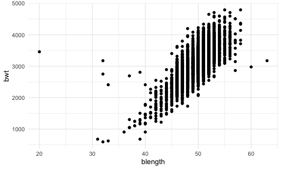
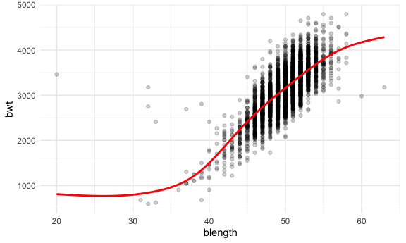
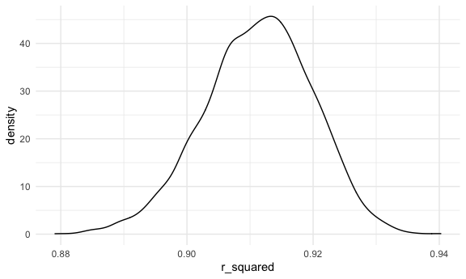

Homework 6
================

``` r
library(tidyverse)
library(viridis)

library(modelr)
library(mgcv)

knitr::opts_chunk$set(
  fig.width = 6,
  fig.asp = .6,
  out.width = "90%"
)

theme_set(theme_minimal() + theme(legend.position = "bottom"))

options(
  ggplot2.continuous.colour = "viridis",
  ggplot2.continuous.fill = "viridis"
)

scale_colour_discrete = scale_colour_viridis_d
scale_fill_discrete = scale_fill_viridis_d
```

## Problem 1

``` r
birthweight_df = 
  read_csv("data/birthweight.csv") %>% 
  mutate(babysex = as.factor(babysex), 
         babysex = fct_recode(babysex, "male" = "1", "female" = "2"),
         fincome = fincome*100, 
         frace = as.factor(frace), 
         frace = fct_recode(frace, "white" = "1", "black" = "2", "asian" = "3",
                       "puerto rican" = "4", "other" = "8"),
         malform = as.logical(malform), 
         mrace = as.factor(mrace), 
         mrace = fct_recode(mrace, "white" = "1", "black" = "2", "asian" = "3",
                       "puerto rican" = "4"))
```

    ## Rows: 4342 Columns: 20

    ## ── Column specification ────────────────────────────────────────────────────────
    ## Delimiter: ","
    ## dbl (20): babysex, bhead, blength, bwt, delwt, fincome, frace, gaweeks, malf...

    ## 
    ## ℹ Use `spec()` to retrieve the full column specification for this data.
    ## ℹ Specify the column types or set `show_col_types = FALSE` to quiet this message.

Checking for missing values by grouping by factor variables to identify
possible values:

``` r
birthweight_df %>% 
  group_by(babysex) %>% 
  summarize()
```

    ## # A tibble: 2 × 1
    ##   babysex
    ##   <fct>  
    ## 1 male   
    ## 2 female

``` r
birthweight_df %>% 
  group_by(frace) %>% 
  summarize()
```

    ## # A tibble: 5 × 1
    ##   frace       
    ##   <fct>       
    ## 1 white       
    ## 2 black       
    ## 3 asian       
    ## 4 puerto rican
    ## 5 other

``` r
birthweight_df %>% 
  group_by(malform) %>% 
  summarize()
```

    ## # A tibble: 2 × 1
    ##   malform
    ##   <lgl>  
    ## 1 FALSE  
    ## 2 TRUE

``` r
birthweight_df %>% 
  group_by(mrace) %>% 
  summarize()
```

    ## # A tibble: 4 × 1
    ##   mrace       
    ##   <fct>       
    ## 1 white       
    ## 2 black       
    ## 3 asian       
    ## 4 puerto rican

``` r
birthweight_df
```

    ## # A tibble: 4,342 × 20
    ##    babysex bhead blength   bwt delwt fincome frace gaweeks malform menarche
    ##    <fct>   <dbl>   <dbl> <dbl> <dbl>   <dbl> <fct>   <dbl> <lgl>      <dbl>
    ##  1 female     34      51  3629   177    3500 white    39.9 FALSE         13
    ##  2 male       34      48  3062   156    6500 black    25.9 FALSE         14
    ##  3 female     36      50  3345   148    8500 white    39.9 FALSE         12
    ##  4 male       34      52  3062   157    5500 white    40   FALSE         14
    ##  5 female     34      52  3374   156     500 white    41.6 FALSE         13
    ##  6 male       33      52  3374   129    5500 white    40.7 FALSE         12
    ##  7 female     33      46  2523   126    9600 black    40.3 FALSE         14
    ##  8 female     33      49  2778   140     500 white    37.4 FALSE         12
    ##  9 male       36      52  3515   146    8500 white    40.3 FALSE         11
    ## 10 male       33      50  3459   169    7500 black    40.7 FALSE         12
    ## # … with 4,332 more rows, and 10 more variables: mheight <dbl>, momage <dbl>,
    ## #   mrace <fct>, parity <dbl>, pnumlbw <dbl>, pnumsga <dbl>, ppbmi <dbl>,
    ## #   ppwt <dbl>, smoken <dbl>, wtgain <dbl>

``` r
birthweight_df %>% 
  drop_na()
```

    ## # A tibble: 4,342 × 20
    ##    babysex bhead blength   bwt delwt fincome frace gaweeks malform menarche
    ##    <fct>   <dbl>   <dbl> <dbl> <dbl>   <dbl> <fct>   <dbl> <lgl>      <dbl>
    ##  1 female     34      51  3629   177    3500 white    39.9 FALSE         13
    ##  2 male       34      48  3062   156    6500 black    25.9 FALSE         14
    ##  3 female     36      50  3345   148    8500 white    39.9 FALSE         12
    ##  4 male       34      52  3062   157    5500 white    40   FALSE         14
    ##  5 female     34      52  3374   156     500 white    41.6 FALSE         13
    ##  6 male       33      52  3374   129    5500 white    40.7 FALSE         12
    ##  7 female     33      46  2523   126    9600 black    40.3 FALSE         14
    ##  8 female     33      49  2778   140     500 white    37.4 FALSE         12
    ##  9 male       36      52  3515   146    8500 white    40.3 FALSE         11
    ## 10 male       33      50  3459   169    7500 black    40.7 FALSE         12
    ## # … with 4,332 more rows, and 10 more variables: mheight <dbl>, momage <dbl>,
    ## #   mrace <fct>, parity <dbl>, pnumlbw <dbl>, pnumsga <dbl>, ppbmi <dbl>,
    ## #   ppwt <dbl>, smoken <dbl>, wtgain <dbl>

``` r
summary(birthweight_df)
```

    ##    babysex         bhead          blength           bwt           delwt      
    ##  male  :2230   Min.   :21.00   Min.   :20.00   Min.   : 595   Min.   : 86.0  
    ##  female:2112   1st Qu.:33.00   1st Qu.:48.00   1st Qu.:2807   1st Qu.:131.0  
    ##                Median :34.00   Median :50.00   Median :3132   Median :143.0  
    ##                Mean   :33.65   Mean   :49.75   Mean   :3114   Mean   :145.6  
    ##                3rd Qu.:35.00   3rd Qu.:51.00   3rd Qu.:3459   3rd Qu.:157.0  
    ##                Max.   :41.00   Max.   :63.00   Max.   :4791   Max.   :334.0  
    ##     fincome              frace         gaweeks       malform       
    ##  Min.   :   0   white       :2123   Min.   :17.70   Mode :logical  
    ##  1st Qu.:2500   black       :1911   1st Qu.:38.30   FALSE:4327     
    ##  Median :3500   asian       :  46   Median :39.90   TRUE :15       
    ##  Mean   :4411   puerto rican: 248   Mean   :39.43                  
    ##  3rd Qu.:6500   other       :  14   3rd Qu.:41.10                  
    ##  Max.   :9600                       Max.   :51.30                  
    ##     menarche        mheight          momage              mrace     
    ##  Min.   : 0.00   Min.   :48.00   Min.   :12.0   white       :2147  
    ##  1st Qu.:12.00   1st Qu.:62.00   1st Qu.:18.0   black       :1909  
    ##  Median :12.00   Median :63.00   Median :20.0   asian       :  43  
    ##  Mean   :12.51   Mean   :63.49   Mean   :20.3   puerto rican: 243  
    ##  3rd Qu.:13.00   3rd Qu.:65.00   3rd Qu.:22.0                      
    ##  Max.   :19.00   Max.   :77.00   Max.   :44.0                      
    ##      parity            pnumlbw     pnumsga      ppbmi            ppwt      
    ##  Min.   :0.000000   Min.   :0   Min.   :0   Min.   :13.07   Min.   : 70.0  
    ##  1st Qu.:0.000000   1st Qu.:0   1st Qu.:0   1st Qu.:19.53   1st Qu.:110.0  
    ##  Median :0.000000   Median :0   Median :0   Median :21.03   Median :120.0  
    ##  Mean   :0.002303   Mean   :0   Mean   :0   Mean   :21.57   Mean   :123.5  
    ##  3rd Qu.:0.000000   3rd Qu.:0   3rd Qu.:0   3rd Qu.:22.91   3rd Qu.:134.0  
    ##  Max.   :6.000000   Max.   :0   Max.   :0   Max.   :46.10   Max.   :287.0  
    ##      smoken           wtgain      
    ##  Min.   : 0.000   Min.   :-46.00  
    ##  1st Qu.: 0.000   1st Qu.: 15.00  
    ##  Median : 0.000   Median : 22.00  
    ##  Mean   : 4.145   Mean   : 22.08  
    ##  3rd Qu.: 5.000   3rd Qu.: 28.00  
    ##  Max.   :60.000   Max.   : 89.00

There are no missing values based on the drop NA function

Fitting models

I hypothesize that a few things are key drivers of a baby’s birthweight.
First, baby length is likely to affect birthweight significantly.
Additionally, baby’s head circumference could have a similar effect. I
imagine that male and female babies are relatively similar in weight, so
I doubt that baby’s sex has much of an effect. Mother’s weight gain
during pregnancy could also be an indicator of baby’s weight, as well as
the number of previous low birthweight babies for women who have had
children prior.

``` r
birthweight_df %>% 
  ggplot(aes(x = blength, y = bwt)) +
  geom_point()
```



``` r
# baby length appears to increase with increasing birthweight 

birthweight_df %>% 
  ggplot(aes(x = bhead, y = bwt)) +
  geom_point(alpha = 0.3)
```


``` r
# baby head circumference also appears to increase with increasing birthweight 

birthweight_df %>% 
  ggplot(aes(x = babysex, y = bwt)) +
  geom_point(alpha = 0.3) 
```


``` r
# visual inspection appears to confirm that birthweight is not meaningfully different by sex; further inspection may help to confirm this: 

birthweight_df %>% 
  group_by(babysex) %>% 
  summarize(mean_bwt = mean(bwt))
```

    ## # A tibble: 2 × 2
    ##   babysex mean_bwt
    ##   <fct>      <dbl>
    ## 1 male       3158.
    ## 2 female     3069.

``` r
# weights differ by less than 3% so this is not likely an informative predictor

birthweight_df %>% 
  ggplot(aes(x = wtgain, y = bwt)) +
  geom_point(alpha = 0.3)
```


``` r
# this also doesn't appear to demonstrate a meaningful trend 

birthweight_df %>% 
  ggplot(aes(x = gaweeks, y = bwt)) +
  geom_point(alpha = 0.3)
```


``` r
#There does appear to be a trend here; potentially, the interaction between gestational weeks and body length could be interesting, as a baby's head is usually first to develop and is large in proportion to the rest of its body for the majority of the gestational period

birthweight_df %>% 
  ggplot(aes(x = pnumlbw, y = bwt)) +
  geom_point(alpha = 0.3)
```


``` r
# There appear to be no values other than 0 for this variable 

birthweight_df %>% 
  group_by(pnumlbw) %>% 
  summarize(obs = n())
```

    ## # A tibble: 1 × 2
    ##   pnumlbw   obs
    ##     <dbl> <int>
    ## 1       0  4342

``` r
# finding confirmed - variable will not be included 

fit_mine = lm(bwt ~ blength + gaweeks*bhead, data = birthweight_df)

fit_mine %>% 
  broom::tidy()
```

    ## # A tibble: 5 × 5
    ##   term          estimate std.error statistic   p.value
    ##   <chr>            <dbl>     <dbl>     <dbl>     <dbl>
    ## 1 (Intercept)   -4699.     700.        -6.72 2.12e- 11
    ## 2 blength          82.3      2.10      39.1  5.13e-287
    ## 3 gaweeks         -25.5     18.6       -1.37 1.71e-  1
    ## 4 bhead            92.6     21.7        4.27 2.04e-  5
    ## 5 gaweeks:bhead     1.21     0.561      2.16 3.08e-  2

``` r
summary(fit_mine)
```

    ## 
    ## Call:
    ## lm(formula = bwt ~ blength + gaweeks * bhead, data = birthweight_df)
    ## 
    ## Residuals:
    ##      Min       1Q   Median       3Q      Max 
    ## -1114.82  -191.34   -10.03   176.98  2617.18 
    ## 
    ## Coefficients:
    ##                 Estimate Std. Error t value Pr(>|t|)    
    ## (Intercept)   -4698.7660   699.7148  -6.715 2.12e-11 ***
    ## blength          82.2611     2.1026  39.123  < 2e-16 ***
    ## gaweeks         -25.4871    18.6228  -1.369   0.1712    
    ## bhead            92.5935    21.7080   4.265 2.04e-05 ***
    ## gaweeks:bhead     1.2115     0.5609   2.160   0.0308 *  
    ## ---
    ## Signif. codes:  0 '***' 0.001 '**' 0.01 '*' 0.05 '.' 0.1 ' ' 1
    ## 
    ## Residual standard error: 286 on 4337 degrees of freedom
    ## Multiple R-squared:  0.6884, Adjusted R-squared:  0.6881 
    ## F-statistic:  2396 on 4 and 4337 DF,  p-value: < 2.2e-16

``` r
modelr::add_residuals(birthweight_df, fit_mine) %>% 
  add_predictions(fit_mine) %>% 
  ggplot(aes(x = pred, y = resid)) + 
  geom_point()
```


Because the residuals are all grouped together around 0, we know this is
a reasonable model.

``` r
fit_length = lm(bwt ~ blength + gaweeks, data = birthweight_df)

summary(fit_length)
```

    ## 
    ## Call:
    ## lm(formula = bwt ~ blength + gaweeks, data = birthweight_df)
    ## 
    ## Residuals:
    ##     Min      1Q  Median      3Q     Max 
    ## -1709.6  -215.4   -11.4   208.2  4188.8 
    ## 
    ## Coefficients:
    ##              Estimate Std. Error t value Pr(>|t|)    
    ## (Intercept) -4347.667     97.958  -44.38   <2e-16 ***
    ## blength       128.556      1.990   64.60   <2e-16 ***
    ## gaweeks        27.047      1.718   15.74   <2e-16 ***
    ## ---
    ## Signif. codes:  0 '***' 0.001 '**' 0.01 '*' 0.05 '.' 0.1 ' ' 1
    ## 
    ## Residual standard error: 333.2 on 4339 degrees of freedom
    ## Multiple R-squared:  0.5769, Adjusted R-squared:  0.5767 
    ## F-statistic:  2958 on 2 and 4339 DF,  p-value: < 2.2e-16

``` r
fit_interaction = lm(bwt ~ bhead*blength*babysex, data = birthweight_df)

summary(fit_interaction)
```

    ## 
    ## Call:
    ## lm(formula = bwt ~ bhead * blength * babysex, data = birthweight_df)
    ## 
    ## Residuals:
    ##      Min       1Q   Median       3Q      Max 
    ## -1132.99  -190.42   -10.33   178.63  2617.96 
    ## 
    ## Coefficients:
    ##                               Estimate Std. Error t value Pr(>|t|)    
    ## (Intercept)                 -7176.8170  1264.8397  -5.674 1.49e-08 ***
    ## bhead                         181.7956    38.0542   4.777 1.84e-06 ***
    ## blength                       102.1269    26.2118   3.896 9.92e-05 ***
    ## babysexfemale                6374.8684  1677.7669   3.800 0.000147 ***
    ## bhead:blength                  -0.5536     0.7802  -0.710 0.478012    
    ## bhead:babysexfemale          -198.3932    51.0917  -3.883 0.000105 ***
    ## blength:babysexfemale        -123.7729    35.1185  -3.524 0.000429 ***
    ## bhead:blength:babysexfemale     3.8781     1.0566   3.670 0.000245 ***
    ## ---
    ## Signif. codes:  0 '***' 0.001 '**' 0.01 '*' 0.05 '.' 0.1 ' ' 1
    ## 
    ## Residual standard error: 287.7 on 4334 degrees of freedom
    ## Multiple R-squared:  0.6849, Adjusted R-squared:  0.6844 
    ## F-statistic:  1346 on 7 and 4334 DF,  p-value: < 2.2e-16

``` r
# maybe delete this? think about it 

birthweight_df %>% 
  add_predictions(fit_mine) %>% 
  ggplot(aes(x = blength, y = bwt)) + 
  geom_point(alpha = .2) + 
  geom_smooth(aes(y = pred), color = "red", se = FALSE)
```

    ## `geom_smooth()` using method = 'gam' and formula 'y ~ s(x, bs = "cs")'


``` r
birthweight_df %>% 
  add_predictions(fit_length) %>% 
  ggplot(aes(x = blength, y = bwt)) + 
  geom_point(alpha = .2) + 
  geom_smooth(aes(y = pred), color = "red", se = FALSE)
```

    ## `geom_smooth()` using method = 'gam' and formula 'y ~ s(x, bs = "cs")'


``` r
birthweight_df %>% 
  add_predictions(fit_interaction) %>% 
  ggplot(aes(x = blength, y = bwt)) + 
  geom_point(alpha = .2) + 
  geom_smooth(aes(y = pred), color = "red", se = FALSE)
```

    ## `geom_smooth()` using method = 'gam' and formula 'y ~ s(x, bs = "cs")'



``` r
cv_df = 
  crossv_mc(birthweight_df, 100) %>% 
  mutate(
    train = map(train, as_tibble), 
    test = map(test, as_tibble)
  )

cv_df = 
  cv_df %>% 
  mutate(
    fit_mine = map(.x = train, ~lm(bwt ~ blength + gaweeks*bhead, data = .x)), 
    fit_length = map(.x = train, ~lm(bwt ~ blength + gaweeks, data = .x)), 
    fit_interaction = map(.x = train, ~lm(bwt ~ bhead*blength*babysex, data = .x))
  ) %>% 
  mutate(
    rmse_mine = map2_dbl(.x = fit_mine, .y = test, ~rmse(model = .x, data = .y)), 
    rmse_length = map2_dbl(.x = fit_length, .y = test, ~rmse(model = .x, data = .y)), 
    rmse_interaction = map2_dbl(.x = fit_interaction, .y = test, ~rmse(model = .x, data = .y)))
```

``` r
cv_df %>% 
  select(.id, starts_with("rmse")) %>% 
  pivot_longer(
    rmse_mine:rmse_interaction, 
    names_to = "model", 
    values_to = "rmse", 
    names_prefix = "rmse_"
  ) %>% 
  ggplot(aes(x = model, y = rmse)) + 
  geom_boxplot()
```


## Problem 2

``` r
weather_df = 
  rnoaa::meteo_pull_monitors(
    c("USW00094728"),
    var = c("PRCP", "TMIN", "TMAX"), 
    date_min = "2017-01-01",
    date_max = "2017-12-31") %>%
  mutate(
    name = recode(id, USW00094728 = "CentralPark_NY"),
    tmin = tmin / 10,
    tmax = tmax / 10) %>%
  select(name, id, everything())
```

    ## Registered S3 method overwritten by 'hoardr':
    ##   method           from
    ##   print.cache_info httr

    ## using cached file: ~/Library/Caches/R/noaa_ghcnd/USW00094728.dly

    ## date created (size, mb): 2021-10-05 10:31:07 (7.602)

    ## file min/max dates: 1869-01-01 / 2021-10-31

``` r
bootstrap_weather = 
  weather_df %>% 
    bootstrap(n = 5000, id = "strap_number")

log_beta_df = 
bootstrap_weather %>% 
    mutate(
      models = map(.x = strap, ~lm(tmax ~ tmin, data = .x)), 
      results = map(models, broom::tidy), 
      glance = map(models, broom::glance))

log_beta_df %>% 
    unnest(results) %>% 
      select(strap:estimate) %>% 
  pivot_wider(names_from = "term", 
              values_from = "estimate") %>% 
  janitor::clean_names() %>% 
    mutate(log_beta = log(tmin*intercept)) %>% 
  ggplot(aes(x = log_beta)) + 
  geom_density()
```


``` r
r_squared_df = 
log_beta_df %>% 
    unnest(glance) %>% 
  janitor::clean_names() 


r_squared_df %>% 
  ggplot(aes(x = r_squared)) + 
  geom_density()
```



``` r
quantile(r_squared_df$r_squared, probs = c(0.025, 0.975), na.rm = FALSE)
```

    ##      2.5%     97.5% 
    ## 0.8938446 0.9274769

The 95% CI for the r squared estimates is 0.894 to 0.927
